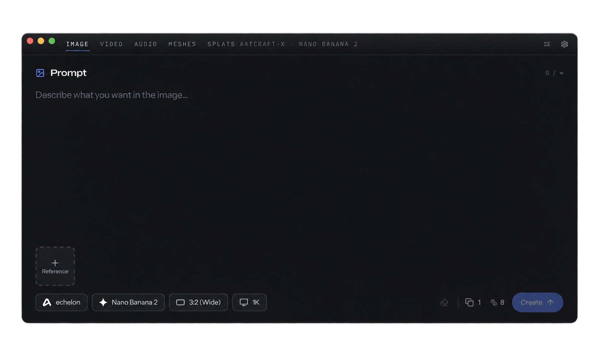

<h1 align="center">ArtCraft-X</h1>

  

A minimal desktop app for AI creation.

  Images · Video · Audio · 3D Meshes · Worlds

  <a href="https://getartcraft.com/">ArtCraft Website</a> ·
  <a href="https://github.com/storytold/artcraft">ArtCraft Repository</a>

  
  
  
  

  <strong>Early Experimental Release</strong> 
  Builds are Forthcoming

